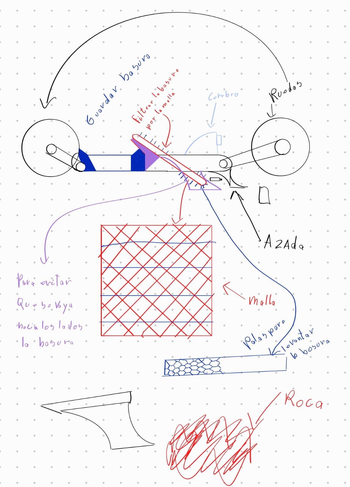
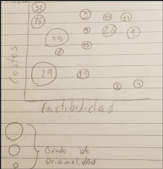
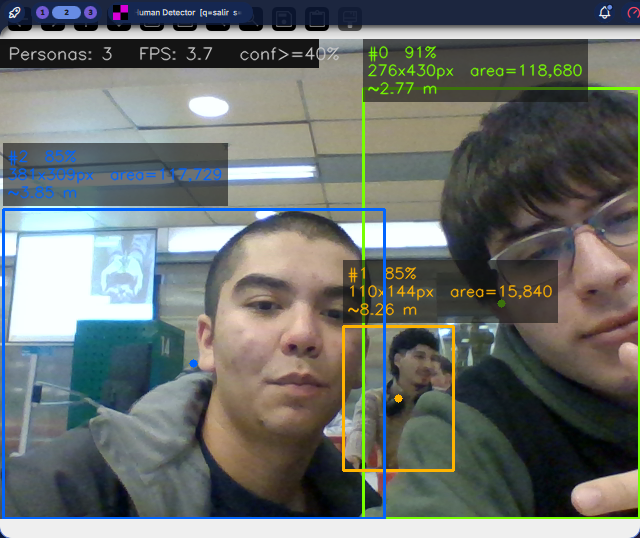

# Blog del proyecto Wall-I's
Por Felipe Colli, Benjamín Bascuñán, Joaquín Pérez, Agustín Concha, Diego Alvarado

***

## Entradas de blog

### 19/03

#### Trabajo de hoy
- Empezar a rellenar el contrato de trabajo.
- Análisis inicial de fortalezas y debilidades.
- Inicio de investigación sobre contaminación en playas chilenas.
- Lluvia de ideas sobre la temática del proyecto.

#### Fortalezas como equipo
- Orientación a la calidad y al detalle.
- Responsabilidad.
- Estabilidad.

#### Desafíos como equipo
- Dominancia extrema, ya sea muy baja o muy alta.
- Resistencia al cambio.
- Tendencia al perfeccionismo.

***

### 26/03

#### Contexto
Chile tiene casi 6.500 km de costa y aproximadamente 900 playas. Muchas de ellas enfrentan un problema crítico de contaminación superficial y subsuperficial por culpa de la acción humana, incluyendo colillas de cigarro, tapas, vidrios y envases. La limpieza manual actual es ineficiente y no logra extraer la basura que queda enterrada.

#### Alcance social
Nuestro proyecto permitirá mecanizar y optimizar la limpieza profunda de las playas sin perturbar el uso normal de estas, ya que se espera que el modelo final funcione de noche y temprano en la madrugada. Al remover la basura enterrada que la limpieza manual omite, Wallis mejorará el entorno para la fauna costera y devolverá el valor recreativo a los balnearios.

#### Expectativas y desafíos
Esta problemática resuena con nuestro equipo debido a experiencias personales y a la preocupación por la contaminación en playas.

##### Desafíos esperados
- Ninguno vive en la playa o cerca.
- Quemar parte de la electrónica.
- No tener recursos suficientes.
- No tener tiempo suficiente.
- Diferencias en conocimiento.
- Que se caiga el servidor de Minecraft.

#### Fuentes de información
Esta información se encuentra adjuntada en el PDF del curso.

#### Planificación de la observación

##### Lugar
Visitaremos una ciudad costera con playa para realizar un catastro inicial de la situación de las playas en Chile, considerando lugares cercanos a la Región Metropolitana.

##### Personas implicadas
Este proyecto va dirigido a comunidades costeras y, principalmente, a municipalidades costeras. Observaremos y entrevistaremos a personas que usan la playa, como pescadores, turistas y otros actores que dependen del borde costero para recreación o sustento económico.

##### Elementos a observar
- Cantidad de contaminación y tipos de contaminantes presentes en la arena.
- Horarios de uso y momentos de mayor y menor tráfico.

##### Cuándo
Fin de semana por definir, idealmente después de la hora de almuerzo.

##### Medios de registro a usar
- Notas de campo.
- Fotografías.
- Videos.
- Audios.

##### Preguntas para entrevista

###### A usuarios y turistas
- ¿Con qué frecuencia visitas esta playa?
- ¿Has notado basura en la arena o enterrada bajo la superficie?
- ¿Qué tipos de basura ves más seguido en la arena?
- ¿Alguna vez tú o alguien que conoces se ha lastimado por basura en la playa?
- ¿Te molesta la basura en la playa al momento de disfrutar el lugar?
- ¿Has visto cómo se limpia esta playa actualmente? ¿Quién la limpia?
- Si existiera un robot que limpiara la arena de noche, ¿qué te parecería?
- ¿Qué te preocuparía de que una máquina funcione en la playa, como ruido, seguridad o apariencia?

###### A trabajadores, pescadores, comerciantes, personal de aseo y salvavidas
- ¿Cuál es tu relación con esta playa?
- ¿Quién se encarga de la limpieza de la arena normalmente?
- ¿Con qué frecuencia se realiza la limpieza?
- ¿Qué tipos de basura encuentras más frecuentemente en la arena?
- ¿La basura enterrada es un problema para ustedes? ¿En qué situaciones?
- ¿Qué dificultades tienen para mantener limpia la playa?
- ¿Qué cambios te gustaría ver en la forma en que se limpia la playa?
- ¿Cómo verías el uso de un robot que limpie la arena de forma más profunda?

###### Cierre
- ¿Hay algo más que te gustaría comentar sobre la limpieza o el estado de esta playa?

##### Planificación detallada de la observación

###### ¿Qué vamos a observar?
- Tipo y cantidad de basura presente en la arena, como colillas, vidrios, plásticos y latas.
- Profundidad aproximada a la que se entierra la basura visible.
- Cómo se realiza actualmente la limpieza de la playa.
- Uso de la playa, actividades principales y zonas más concurridas.

###### ¿Cómo lo vamos a observar?
- Observación no participante, con registro estructurado en una planilla de conteo de residuos.
- Recorridos definidos a lo largo de la playa, anotando observaciones cada ciertos metros.
- Entrevistas breves semiestructuradas a usuarios y trabajadores.

###### ¿Cuándo lo vamos a observar?
- Un fin de semana por definir, idealmente entre las 15:00 y las 17:00.
- Duración estimada de 2 a 3 horas en terreno.

###### ¿Con qué lo vamos a observar?
- Celulares para fotografías, videos y grabación de audio.
- Hojas o planillas impresas para notas de campo y conteo de residuos.
- Lápices y elementos básicos de escritura.

###### ¿Dónde lo vamos a observar?
- Playa por definir dentro de las más cercanas a la Región Metropolitana, como El Quisco, Algarrobo o Cartagena.
- Tramo delimitado de entre 200 y 300 metros lineales.

###### ¿Quiénes estarán presentes?
- Los 5 integrantes del equipo, con roles definidos.
- 1 encargado de notas de campo.
- 1 encargado de fotografías y videos.
- 1 o 2 encargados de realizar entrevistas.
- 1 encargado de registrar conteos en la planilla.

###### ¿Qué circunstancias podrían influir?
- Condiciones climáticas adversas.
- Temporada baja o día de poca concurrencia.
- Eventos especiales en la playa.

###### Objetivos de la observación
- Caracterizar los tipos de residuos presentes en la arena y su distribución.
- Entender cómo y con qué frecuencia se limpia actualmente la playa.
- Identificar problemas y necesidades que un robot como Wallis podría abordar mejor.

###### ¿Cómo se manejarán los datos?
- Consolidación de los conteos de residuos por tipo y sector de playa en una hoja de cálculo.
- Clasificación de fotografías y videos según zona y horario.
- Transcripción y agrupación temática de ideas clave provenientes de entrevistas.

###### Duración de la observación
- 2 a 3 horas continuas en terreno, en una primera visita piloto.
- Posible segunda visita en otro horario si el tiempo del curso lo permite.

###### Criterios de éxito
- Completar el recorrido planeado.
- Obtener una cantidad mínima útil de registros de basura por tipo.
- Realizar al menos 5 entrevistas breves.

###### Limitaciones previstas
- Solo se observará una playa y en una fecha específica.
- Falta de instrumentos para medir con precisión la profundidad de enterramiento de residuos.
- Posible negativa de algunas personas a ser entrevistadas o fotografiadas.

#### Mapa de empatía

##### Arquetipo 1: Sebastián Carvajal, usuario de borde costero, 38 años
- **Ve:** una playa sucia, contaminada por colillas, microplásticos y otros residuos.
- **Oye:** comentarios sobre el poco cuidado ambiental y la contaminación creciente.
- **Piensa:** que las personas deberían hacerse responsables de sus residuos y que es desagradable y peligroso caminar sobre arena contaminada.
- **Hace:** recoge basura cuando puede y la deposita en contenedores.
- **Resultado:** valora la limpieza, pero rechaza intervenciones humanas o mecánicas ruidosas mientras disfruta de la playa.

***

### 16/04
- Discutir la presentación del día 14/04, identificando aciertos y errores.
- Recibir retroalimentación de la Tarea 3.
- Iniciar el trabajo en el reporte del Hito 1.

***

### 23/04

#### ¿Qué hicimos?
Escuchamos a Max, quien explicó el funcionamiento del FabLab, incluyendo la agendación de impresora 3D mediante Discord, los materiales disponibles y distintas aplicaciones para modelado e impresión 3D.

#### ¿Qué aprendimos?
Aprendimos a agendar horas en el FabLab para imprimir, conocimos temperaturas de materiales específicos y entendimos mejor cómo funciona el proceso de impresión 3D.

#### ¿Cómo puede ayudar esta experiencia a nuestro proyecto?
Esta experiencia nos sirve para elaborar piezas 3D que puedan aportar tanto a la funcionalidad como a la apariencia del proyecto.

***

### 28/04

#### ¿Qué hicimos?
Asistimos a la charla de **Open Beauchef**, donde se presentaron diversas formas de acceder a financiamiento y mentorías para potenciar proyectos nacidos dentro de la facultad y la universidad. Además, definimos preguntas para la Tarea 4.

#### ¿Qué aprendimos?
Comprendimos el funcionamiento general de Open Beauchef, el tipo de apoyo que brindan y los procesos de postulación. También exploramos el acceso a datos satelitales, un recurso que podría ser clave para el desarrollo del proyecto.

#### ¿Cuáles son nuestros siguientes pasos?
Finalizar la **Tarea 4**.

***

### 05/05

Recopilamos información para la Actividad 8 sobre:
- Tractores limpiaplayas.
- Voluntariados.
- Robots limpiaplayas.
- Leyes sobre limpieza de playas.
- Impacto de actividades de concientización.

***

### 07/05

#### Actividad 8.1

##### Reencuadre del problema y objetivo
En el contexto de playas chilenas, especialmente en temporada alta, residentes, turistas y equipos de aseo municipal tienen dificultades para mantener la playa libre de basura enterrada, como macroplásticos, colillas y vidrios. La limpieza predominante es manual y superficial, por lo que no alcanza la contaminación subsuperficial que se acumula con el uso y el tiempo. Esto provoca riesgos de accidentes, degradación ambiental y una peor experiencia de uso del borde costero.

El objetivo es que las personas usuarias y actores del borde costero puedan contar con playas más seguras y limpias, reduciendo residuos subsuperficiales de forma efectiva, accesible y sostenible, sin dañar el ecosistema ni precarizar el trabajo de limpieza.

##### Preguntas movilizadoras
1. ¿Cómo podríamos reducir la presencia de residuos enterrados para disminuir el riesgo de cortes y accidentes en residentes y turistas en playas chilenas de alta concurrencia?
2. ¿Cómo podríamos facilitar la limpieza de residuos subsuperficiales para mejorar la seguridad y la percepción de cuidado del entorno en trabajadores municipales y voluntarios del borde costero chileno?
3. ¿Cómo podríamos aumentar la efectividad de la gestión de residuos en playa para minimizar la acumulación y reaparición de basura enterrada en comunidades costeras durante temporadas de alta afluencia turística?

#### Actividad 8.2

| Problema | Nombre de la solución | Cómo es | Quién la está utilizando | Cómo soluciona el problema | Fuentes |
| :--- | :--- | :--- | :--- | :--- | :--- |
| **Basura en las playas** | Tractores limpiaplayas | Tractores que arrastran módulos que levantan la basura y la separan de la arena. | Antofagasta, Río de Janeiro, Collahuasi, entre otros. | Eliminan basura grande de la superficie. | [Enlace](https://www.collahuasi.cl/moderna-maquina-limpiadora-de-playas-suma-el-retiro-de-43-toneladas-de-basura-en-iquique/) |
|  | Voluntariados | Grupos impulsados por instituciones que se organizan para limpiar playas. | Múltiples comunas a lo largo de Chile. | Recolectan basura visible sobre la arena. | [Enlace](https://www.directemar.cl/directemar/intereses-maritimos/limpieza-de-playas/limpieza-de-playas) |
|  | Robots limpiaplayas | Maquinaria autónoma diseñada para limpiar arenas de playas. | Gdansk, por ejemplo. | Limpian de forma específica, como colillas o filtrado de arena. | [Enlace](https://www.whitemad.pl/es/bebot-un-robot-que-limpia-playas-aparece-en-gdansk/) |
|  | Prohibición de plásticos de un solo uso | Ley que prohíbe la venta de ciertos envases plásticos y bolsas. | Todo Chile. | Reduce el ingreso de plásticos a las playas al limitar su uso y comercialización. | [Enlace](https://chile.oceana.org/comunicados/oceana-y-cientificos-de-la-basura-publican-estudio-sobre-desechos-en-las-playas-de-chile-colillas-y-plasticos-de-un-solo-uso-lideran-el-ranking/) |
|  | Impacto de actividades de concientización | Iniciativas y campañas que buscan reducir conductas contaminantes y promover limpieza comunitaria. | Estudiantes y organizaciones locales. | Cambian hábitos y movilizan acción colectiva. | [Enlace](https://www.uc.cl/noticias/la-iniciativa-estudiantil-que-ha-logrado-retirar-5-toneladas-de-basura-de-las-playas/?utm_source=perplexity) |

#### Organización del Hito 2

Repartimos el trabajo en 5 partes:
1. Presentación.
2. Matriz aplicada del problema más PESTEL.
3. Mapas de empatía.
4. Análisis y reunión de información para la presentación y apoyo al reporte.
5. Redacción del reporte.

#### Organización de la Tarea 4
- Cada integrante realiza 1 entrevista, la fecha de validación y el mapa de empatía correspondiente.
- Joaquín Pérez se encarga de redactar la Tarea 4 en LaTeX.
- Felipe Colli se encarga de estructurar correctamente el LaTeX de la Tarea 4.

***

### 12/05

#### Actividad 9.1

##### Requerimientos del problema
- La solución debe remover basura de los primeros centímetros bajo la superficie de la arena.
- Debe cubrir grandes extensiones de playa sin depender de un número alto de personas.
- Debe operar de manera autónoma, sin requerir un operador humano constante.
- Debe poder funcionar de noche para no interrumpir el turismo ni las actividades en la playa.
- Debe ser viable técnica y económicamente para el contexto chileno.

##### Brainstorming de atributos de la propuesta

| Atributo | Descripción |
|---|---|
| Autónomo | Opera sin conductor humano durante su ciclo de limpieza |
| Nocturno | Trabaja en horario de bajo tráfico para no molestar a los usuarios |
| Mecánico | Usa un sistema físico de cribado o tamizado para separar residuos de la arena |
| Subsuperficial | Remueve los primeros 15 cm de arena, alcanzando basura enterrada |
| Escalable | Diseño tipo tractor adaptable a distintos tamaños de playa |
| Devolutivo | Retorna la arena limpia al lugar de origen, sin alterar el ecosistema |

##### Naturaleza de la propuesta conceptual
**Tipo:** producto, robot físico autónomo tipo tractor.

En esta etapa se desarrollará un **Demostrador de Concepto (PoC) a escala**, cuyo objetivo es validar tecnológicamente el mecanismo de remoción, tamizado y devolución de arena.

##### Frase o propuesta conceptual
> **Wallis**, robot autónomo tipo tractor, limpiador de macroplásticos y residuos enterrados, autónomo, nocturno y subsuperficial.

#### Actividad 9-2: Análisis del estado del arte

**Problema:** basura en las playas chilenas, tanto superficial como enterrada, incluyendo colillas, plásticos, vidrios, envases y otros residuos que la limpieza manual no logra eliminar completamente.

| Nombre de la solución | ¿Cómo es? | ¿Quién la está usando? | ¿Cómo soluciona el problema? | Fuente |
|---|---|---|---|---|
| Tractores limpiaplayas | Tractores que arrastran módulos que levantan la capa superficial de arena, la tamizan y separan la basura grande de la arena limpia. | Antofagasta, Río de Janeiro, Operación Collahuasi, entre otros. | Eliminan basura de mayor tamaño en grandes extensiones. | [BeachTech](https://www.beach-tech.com/en/beach-cleaners) |
| Voluntariados de limpieza de playas | Grupos organizados por instituciones, universidades o municipios que realizan jornadas de limpieza manual. | Múltiples comunas de Chile. | Recolectan basura visible y generan conciencia comunitaria. | [DIRECTEMAR](https://www.directemar.cl/directemar/intereses-maritimos/limpieza-de-playas/limpieza-de-playas) |
| Robots limpiaplayas | Maquinaria autónoma o semiautónoma diseñada para desplazarse sobre la arena y recolectar residuos. | Playas de España, EE.UU., Polonia y Chile. | Limpian residuos específicos o filtran arena. | [BeBot](https://searial-cleaners.com/our-cleaners/bebot-the-beach-cleaner/) |
| Prohibición de plásticos de un solo uso | Ley chilena que restringe la venta y entrega de ciertos plásticos desechables. | Todo Chile. | Reduce el ingreso de plásticos a las playas desde la fuente. | [Oceana Chile](https://oceana.org/victories/chile-protects-oceans-single-use-plastics-mandates-refillable-bottle/) |
| Campañas de concientización ambiental | Iniciativas educativas que buscan reducir conductas contaminantes. | Estudiantes y organizaciones locales. | Cambian hábitos y movilizan acción colectiva. | [UC Chile](https://www.uc.cl/noticias/la-iniciativa-estudiantil-que-ha-logrado-retirar-5-toneladas-de-basura-de-las-playas/) |

#### Actividad 9.3

##### Objetivo
Analizar y comparar las soluciones existentes identificadas en el estado del arte, evaluándolas según atributos clave relevantes para el problema de contaminación en playas.

##### Atributos seleccionados
- **Elimina basura enterrada:** capacidad de remover residuos bajo la superficie de la arena.
- **Escalable / Cubre grandes superficies:** posibilidad de operar en extensiones amplias sin depender de mucho personal.
- **Autónoma / No requiere operador constante:** funcionamiento sin supervisión humana permanente.
- **Aplicable en Chile, costo y accesibilidad:** viabilidad económica y práctica en el contexto chileno.

##### Matriz de atributos vs soluciones

| Atributo | Tractores limpiaplayas | Voluntariados | Robots limpiaplayas | Prohibición de plásticos de un solo uso | Campañas de concientización |
|---|---|---|---|---|---|
| **Elimina basura enterrada** | Sí, tamiza los primeros centímetros de arena. | No, solo recoge basura visible. | Algunos sí. | No. | No. |
| **Escalable / Cubre grandes superficies** | Sí. | Limitado. | Limitado por tamaño y velocidad. | Sí, por cobertura legal. | Sí, por alcance social. |
| **Autónoma / No requiere operador constante** | No. | No. | Parcialmente. | Sí. | No. |
| **Aplicable en Chile, costo y accesibilidad** | Sí, ya se usa en algunas comunas. | Sí, aunque con baja escala. | Difícil por costos. | Sí, ya está vigente. | Sí. |

##### Análisis comparativo
Ninguna solución existente resuelve el problema de forma completa. Los tractores son efectivos mecánicamente, pero requieren operación humana constante. Los voluntariados tienen impacto social, pero poca cobertura y no remueven basura subsuperficial. Los robots limpiaplayas son prometedores, pero suelen ser costosos o requerir supervisión. La prohibición de plásticos y las campañas de concientización actúan sobre el origen del problema, pero no resuelven la basura ya presente.

##### Oportunidad para Wallis
Estas limitaciones muestran que ninguna solución combina autonomía, tamizado de arena y operación en horarios de bajo tráfico sin intervención humana constante. Esa combinación es la oportunidad principal de innovación para Wallis.

***

### 14/05

#### ¿Cómo fue nuestro trabajo con el circuito?
Nuestro trabajo con circuitos fue didáctico y nos pareció una actividad grata para empezar a adentrarnos en el mundo de la electrónica.

#### ¿Qué aprendimos?
Aprendimos a realizar circuitos eléctricos con protoboards y a comprender mejor el funcionamiento de los circuitos integrados.

***

### 21/05

Esta semana nos dedicamos a finalizar la Tarea 4 y la presentación para el Hito 2. También comenzamos la redacción del reporte del Hito 2.

Para la presentación definimos la siguiente distribución de secciones:

| Sección | Responsable |
|---|---|
| Portada y saludo | Agus |
| Delimitación del problema | Colli |
| Metodología utilizada para delimitar | Agus |
| Hallazgos clave | Diego B. |
| Objetivo, puente a los requerimientos | Joako |
| Requerimientos, parte 1 y 2 | Benja |
| Próximos pasos | Colli |
| Despedida | Agus |

***

### 26/05

Esta semana finalizamos el reporte del Hito 2 para poder avanzar hacia las siguientes etapas del proyecto.

#### Conclusiones post presentación
- Faltó mayor capacidad de dicción frente al público.
- La presentación estuvo demasiado estructurada como informe y con exceso de texto.
- No incluimos un balance ético del proyecto. Nuestra solución no busca reemplazar a voluntarios ni a trabajadores de limpieza, sino complementar su labor.
- Hubo falta de coordinación al momento de presentar, especialmente en las transiciones entre secciones.
- Faltó más práctica y dominio de los contenidos expuestos.

***

### 28/05

Laboratorio de hoy.
`#estamosalbordedelalocura`

#### Actividad 10-1: Matriz de atributos vs soluciones
En esta actividad revisamos soluciones existentes vinculadas a la limpieza de playas y las comparamos a partir de atributos relevantes para nuestro proyecto. Este análisis permitió observar con mayor claridad qué aspectos ya están siendo abordados por otras soluciones y cuáles siguen representando oportunidades concretas de innovación.

A partir de la matriz, concluimos que muchas de las soluciones actuales resuelven solo una parte del problema. Algunas recogen residuos visibles en superficie y otras presentan cierto nivel de mecanización, pero ninguna combina de manera equilibrada autonomía, operación nocturna, limpieza subsuperficial y viabilidad en el contexto chileno.

Este ejercicio también nos ayudó a reconocer que nuestra propuesta no solo debía ser técnicamente novedosa, sino también responder a vacíos reales detectados en el estado del arte. Más que inventar una solución desconectada de los referentes existentes, el desafío fue identificar qué elementos ya funcionan y cuáles deben ser mejorados o integrados de otra forma.

Como próximos pasos, definimos que nuestra propuesta debía orientarse hacia una solución capaz de operar con mayor autonomía, intervenir residuos enterrados en la arena y adaptarse a las condiciones locales de implementación. Esto sirvió como base para pasar a la siguiente etapa, que consistió en contrastar y seleccionar propuestas conceptuales a partir de esos vacíos detectados.

#### Actividad 10-2: Selección de propuestas conceptuales

##### 1. Contraste de propuestas con vacíos del estado del arte
A partir del análisis previo, identificamos que las soluciones actuales, como tractores, voluntariados y robots importados, no logran combinar autonomía, limpieza subsuperficial y operación nocturna en una solución accesible para el contexto chileno.

| Propuesta conceptual | ¿Qué atributo(s) nuevos resuelve? | ¿Qué le falta aún? | ¿Se relaciona con alguna solución del estado del arte? ¿Cómo? |
| :--- | :--- | :--- | :--- |
| **Idea 1: Wallis, robot autónomo nocturno** | Resuelve la autonomía operativa y la limpieza subsuperficial sin interrumpir el uso turístico de la playa. | Resolver la resistencia de la electrónica frente al ambiente salino. | Se relaciona con los tractores por su lógica de cribado, pero elimina la dependencia de un conductor. |
| **Idea 2: Wallis Mini, PoC a escala** | Permite una validación tecnológica rápida en el FabLab, con menor costo y mayor factibilidad de prototipado. | Tiene menor capacidad para cubrir grandes superficies. | Se relaciona con robots tipo BeBot, pero enfocado en fabricación local y accesibilidad. |
| **Idea 3: Wallis Solar, autosuficiente** | Incorpora sustentabilidad energética y autosuficiencia operativa. | Aumenta la complejidad técnica asociada a energía, peso y autonomía. | Puede entenderse como una evolución hacia una solución física de bajo impacto ambiental. |

##### 2. Análisis de contraste
- **¿Esta idea resuelve atributos no cubiertos por el estado del arte?** Sí. Wallis busca resolver limpieza subsuperficial mediante operación autónoma y nocturna.
- **¿Dónde aporta algo nuevo o diferente?** En la integración de autonomía, operación nocturna y limpieza subsuperficial, además de devolver arena filtrada al entorno.
- **¿Tiene debilidades o atributos aún no resueltos?** Sí, entre ellos la vulnerabilidad de la electrónica, la complejidad técnica y las dificultades logísticas para pruebas en terreno.

##### 3. Evaluación multicriterio de propuestas

| Criterio de evaluación | Propuesta 1: Wallis principal | Propuesta 2: Wallis Mini, PoC | Propuesta 3: Wallis Solar |
| :--- | :---: | :---: | :---: |
| **Viabilidad técnica** | 4 | 5 | 3 |
| **Grado de novedad** | 5 | 4 | 5 |
| **Interés del equipo** | 5 | 5 | 4 |
| **Impacto en el desafío** | 5 | 3 | 5 |
| **Puntaje total** | **19** | **17** | **17** |

**Justificación:** se seleccionó la **Propuesta 1: Wallis** como propuesta principal. Aunque la Propuesta 2 presenta mayor viabilidad inmediata por acceso al FabLab y prototipado a escala, Wallis ofrece mayor impacto potencial al abordar directamente los vacíos críticos detectados.

##### 4. Propuesta conceptual final
**Wallis:** robot limpiador de macroplásticos y residuos enterrados, autónomo, nocturno y subsuperficial.

**Enunciado final:**
*Wallis es un robot autónomo tipo tractor, diseñado para la limpieza de macroplásticos y residuos enterrados en playas, con operación nocturna y capacidad de acción subsuperficial.*

#### Cierre de la semana
Además de estas actividades, seguimos cerrando pendientes del Reporte de Hito 2, incorporando correcciones, ajustando la redacción y alineando mejor la formulación de la propuesta con la evidencia recopilada. Con esto, el proyecto quedó mejor preparado para avanzar hacia la etapa de ideación y desarrollo conceptual.

***

### 02/06

Se realizó un primer boceto conceptual de Wall-I's y se finalizó el reporte del Hito 2.

***

### 04/06/2026

#### Lluvia de ideas
En el laboratorio de hoy realizamos una lluvia de ideas con el objetivo de generar la mayor cantidad posible de propuestas, sin centrarnos inicialmente en su factibilidad. El ejercicio permitió explorar soluciones variadas, desde ideas serias hasta otras claramente exageradas o irónicas. Finalmente, reunimos 34 ideas, varias de las cuales fueron seleccionadas posteriormente para su análisis por factibilidad, costo y grado de originalidad.

Entre las ideas más llamativas surgieron propuestas como traer a Max Verstappen para limpiar playas por su velocidad, pedirle a Taylor Swift y Sabrina Carpenter que llamen a sus fans a no contaminar, o incluso plantear soluciones absurdas como ejecutar a quienes contaminan o eliminar directamente las playas. Aunque varias ideas no eran viables, sirvieron para ampliar el espacio creativo y abrir nuevas conversaciones sobre el problema.

##### Lista de ideas generadas en la lluvia de ideas
Las ideas que luego fueron analizadas aparecen en **negrita**.

1. **Robot que limpia playas**.
2. **Concientizar**.
3. **Comprar un tractor para limpiar las playas**.
4. **Voluntarios**.
5. Ilegalizar los plásticos a nivel nacional.
6. Eliminar las playas.
7. Prohibir ir a la playa.
8. **Poner tachos de basura**.
9. **Hacer propaganda antibasura en playas**.
10. **Persona que contamina, persona lobotomizada**.
11. **Endurecer penas por contaminación en playas**.
12. **Te ejecutan por contaminar**.
13. **Hacer campañas en colegios**.
14. Reducción de penas a reos por limpiar las playas.
15. Bolsas de basura en las entradas a las playas.
16. **Solo venta de cigarros y cigarrillos 100% biodegradables a nivel nacional**.
17. **Solo venta de plásticos 100% biodegradables a nivel nacional**.
18. Un día al mes en que las comunidades limpien sus playas.
19. Mallas debajo de la arena para atrapar basura.
20. Mayor fiscalización.
21. Poner cámaras.
22. Que Max Verstappen ayude a limpiar las playas y hacer una campaña mediática alrededor de eso.
23. **Agregar puntos de reciclaje**.
24. Drones de monitoreo.
25. Disparar desde helicópteros patrullando a gente sorprendida contaminando.
26. **Mallas para ríos**.
27. **Recolectores automáticos**.
28. Anuncios anticontaminación en playas puestos en tiendas.
29. **Arte de basura**.
30. Puestos en las playas que se encarguen de la basura en su alrededor.
31. Hacer tablas de surf en base a la basura recolectada.
32. Playas 100% cerradas para que sean limpiadas y se restaure el equilibrio natural.
33. **Hacer contenedores de basura con la misma basura recolectada en playas**.
34. Que Taylor Swift y Sabrina Carpenter hagan un llamado a sus fans para limpiar playas y no contaminarlas más.

El día de hoy también se evaluó la posibilidad de mover el blog a un archivo Markdown separado llamado `Blog.md`. Se estimó un plazo de 3 días hábiles para realizar la migración correctamente, con una posible fecha de inicio el 8 de junio del presente año.

#### Conclusiones
La lluvia de ideas cumplió su objetivo principal: abrir el espacio creativo sin filtros iniciales y permitir que surgieran propuestas muy distintas entre sí. Aunque varias ideas fueron humorísticas, irreales o directamente inviables, también aparecieron alternativas interesantes que sí pueden seguir desarrollándose, especialmente aquellas relacionadas con automatización, concientización, gestión de residuos e infraestructura de apoyo.

A partir de la discusión posterior, fue posible identificar un subconjunto de ideas más factibles y con mayor potencial de implementación. Estas ideas quedaron mejor posicionadas para ser evaluadas con criterios más concretos como originalidad, costo y factibilidad técnica. En ese sentido, la actividad sirvió no solo para generar opciones, sino también para ordenar el proceso de selección de la propuesta final.

***

## 09/06

### Conclusiones del pitch

El primer pitch resultó atractivo como punto de partida, pero dejó claro que todavía debemos afinar el mensaje principal. La apertura centrada en “enterrarse un plástico roto al caminar descalzo sobre la arena” funciona como ejemplo, aunque no parece lo suficientemente potente como para representar por sí sola la magnitud del problema.

En cambio, la idea de un robot autónomo capaz de limpiar playas de manera eficiente sí logra captar atención inicial. Aun así, esa novedad puede ser cuestionada fácilmente por alguien que conozca referencias internacionales, por lo que debemos enfatizar mejor qué hace distinta a nuestra propuesta y por qué su aplicación en Chile sigue siendo una oportunidad real.

También apareció otro desafío importante: fortalecer la dimensión de rentabilidad del proyecto. Si queremos que la propuesta tenga mayor proyección frente a un inversionista, necesitamos justificar mejor su viabilidad económica y mostrar con más claridad cuál es su valor diferencial frente a otros robots limpiaplayas ya existentes.

**Próximo paso:** redefinir el foco del pitch, mejorar la propuesta de valor y destacar con mayor fuerza el contexto chileno como espacio de innovación.

---

## 10/06

### Migración del blog

Durante esta jornada se completó la migración del blog al archivo `Blog.md`. El cambio se realizó mediante la creación de una rama en Git, seguida de su respectivo *pull request*, el cual fue revisado por Felipe Colli e integrado posteriormente al proyecto.

---

## 11/06

### Prototipo inicial de IA a bordo

Durante el laboratorio se completó el primer prototipo de la IA integrada a bordo de Wallis. Este avance marca un primer paso concreto hacia la incorporación de inteligencia en el sistema, permitiendo comenzar a visualizar cómo podría operar la solución en un contexto más cercano al uso real.

---

### Balance de la semana

Esta semana permitió avanzar tanto en la comunicación del proyecto como en su desarrollo técnico. Por un lado, el pitch ayudó a detectar debilidades en la forma de presentar el problema y la propuesta de valor; por otro, la migración del blog y el prototipo inicial de IA muestran progreso concreto en la documentación y construcción del proyecto.

***

## 18/06

Durante esta semana se comenzó el diseño del pitch y se plantearon las primeras ideas para el póster, avanzando en la forma de presentar el proyecto de manera más clara y atractiva. Este paso fue importante para ordenar el mensaje central de Wallis y definir qué aspectos del problema y la solución debían destacarse con mayor fuerza.

Además, Joaquín comenzó el diseño del primer modelo CAD de Wallis, con el objetivo de imprimirlo en 3D y utilizarlo como referencia física del robot. Aunque para el prototipo se usarán ruedas de mecano, ya que están disponibles dentro del equipo, este modelo permite visualizar mejor la estructura general y avanzar hacia una versión más concreta del sistema.

**Avance del póster:** se inició la definición visual y conceptual de la presentación del proyecto.

**Avance del prototipo:** se comenzó el modelado CAD de Wallis como base para su futura impresión 3D y validación formal.

### Pitch

Todos hemos ido a la playa, pero muchas veces, al llegar y comenzar a caminar, nos encontramos con basura enterrada en la arena, colillas de cigarro o residuos que afectan tanto la experiencia de las personas como el entorno natural. La contaminación en las playas se ha vuelto tan común que muchas veces termina normalizándose, a pesar de ser un problema visible y constante.

Frente a esta situación, presentamos **Wallis**, un robot tipo tractor diseñado para limpiar playas de manera más eficiente. Su objetivo es recolectar basura, colillas de cigarro y otros residuos presentes en la arena, operando principalmente durante la noche y en coordinación con voluntarios, para contribuir a mantener playas más limpias en Chile.

***

## semana del 22 del 06

"Para cerrar, este curso fue mucho más que aprender a idear un robot limpiador de playas; significó un tremendo aprendizaje en el trabajo interdisciplinario y en la gestión de equipo. Al comenzar el semestre, identificamos que el perfeccionismo o la disparidad de conocimientos previos podían ser un freno para nosotros. Sin embargo, salir a terreno a observar el comportamiento de la basura en la arena y planificar las entrevistas para turistas y pescadores nos dio un propósito claro que superó cualquier obstáculo (¡incluso el miedo a que se cayera el servidor de Minecraft!). Nos llevamos la certeza de que la innovación tecnológica con conciencia socioambiental nos transforma en agentes de cambio capaces de devolverle el valor recreativo y ecológico a los casi 6.500 km de costa de nuestro país."
***
